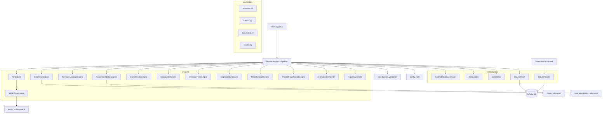
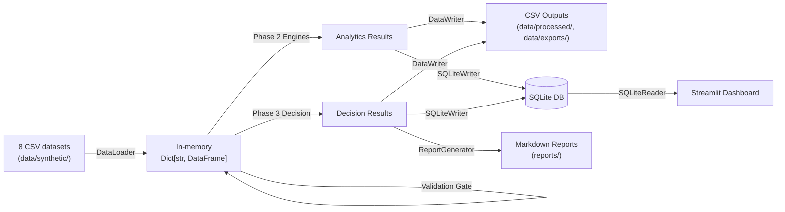

# ProductPulse — Architecture Review

**Scope**: Full codebase (`business-product-analytics`), ~5k lines of Python across 4 packages + Streamlit UI  
**Reviewer**: Architect Review (automated)  
**Date**: 2026-05-18

---

## 1. Architecture Overview



**Pattern**: Layered / Pipeline architecture with YAML-driven configuration. Not microservices — single-process, batch-oriented analytics engine with a read-only Streamlit dashboard.

---

## 2. What Works Well

### ✅ Clean Separation of Concerns
- `adapters/` handles all IO (CSV, SQLite) — zero business logic
- `core/` engines are pure analytical processors
- `models/` contains data contracts (dataclasses, schemas)
- `utils/` holds cross-cutting concerns (paths, validation, logging)
- Pipeline orchestrator wires everything without owning logic

### ✅ YAML-Driven Rule Engines
- Churn rules, recommendation rules, metric catalog — all externalized
- Safe operator dispatch tables (no `eval`/`exec`) in both [churn_risk.py](file:///Users/andrewshwarts/Documents/Git_main/business-product-analytics/src/core/churn_risk.py#L33-L42) and [recommendation_engine.py](file:///Users/andrewshwarts/Documents/Git_main/business-product-analytics/src/core/recommendation_engine.py#L35-L43)
- Business users can adjust thresholds without touching Python

### ✅ Deterministic, Reproducible Runs
- `random_seed` and `as_of_date` in config
- All calculations explicitly implemented — no dynamic formula eval
- Synthetic data generator uses seeded randomness

### ✅ Comprehensive Validation Gate
- [validation.py](file:///Users/andrewshwarts/Documents/Git_main/business-product-analytics/src/utils/validation.py) — pure functions, structured `ValidationResult`
- Pipeline halts on validation errors before analytics run
- 10 distinct check categories (schema, referential integrity, domain constraints, etc.)

### ✅ Schema Contracts
- [schemas.py](file:///Users/andrewshwarts/Documents/Git_main/business-product-analytics/src/models/schemas.py) — centralized column lists for both input and output
- `write_dataframe_with_schema()` validates before write
- SQLite reader validates table names against allowlist

### ✅ Strong Test Coverage
- 46 test files covering every engine, adapter, and utility
- Coverage gate set at 90% (`fail_under = 90`)
- CI runs compile check, lint, typecheck, and coverage

### ✅ Security Posture (for local tool)
- SQLite reader opens in read-only mode (`?mode=ro`)
- Table name validation against allowlist prevents SQL injection
- Column name validation via `str.isidentifier()`
- No secrets in config; `.env.example` provided

---

## 3. Architecture Risks & Issues

### 🔴 HIGH: Pipeline Orchestrator is a God Class (721 lines)

[pipeline.py](file:///Users/andrewshwarts/Documents/Git_main/business-product-analytics/src/core/pipeline.py) — the orchestrator does too much:
- Loads config
- Instantiates all engines
- Runs 7 sequential phases
- Manually serializes every output type (CSV + SQLite)
- Contains duplicated serialization logic between `_phase_write_outputs` and `_phase_write_sqlite_outputs`

**Impact**: Adding new output artifact requires edits in 3 places (schemas.py, CSV writer block, SQLite writer block).  
**Recommendation**: Extract an `OutputSerializer` that reads from `OUTPUT_SCHEMAS` and writes all formats from a single artifact dict. The ~200 lines of duplicated row-building logic should live in one place.

---

### 🔴 HIGH: Module-Level Side Effects in [paths.py](file:///Users/andrewshwarts/Documents/Git_main/business-product-analytics/src/utils/paths.py#L18-L20)

```python
for directory in [CONFIG_DIR, DATA_DIR, ...]:
    directory.mkdir(parents=True, exist_ok=True)
```

Directories are created **at import time**. Any module importing `paths.py` triggers filesystem mutations — even in tests, lint, or type-checking contexts.

**Impact**: Unpredictable side effects during import. Tests may silently create directories.  
**Recommendation**: Move to a `ensure_directories()` function called explicitly from the pipeline's `__init__`.

---

### 🟡 MEDIUM: Governance Accesses Private `_catalog` from Pipeline

[pipeline.py:333](file:///Users/andrewshwarts/Documents/Git_main/business-product-analytics/src/core/pipeline.py#L333) and [pipeline.py:526](file:///Users/andrewshwarts/Documents/Git_main/business-product-analytics/src/core/pipeline.py#L526-L527):
```python
lineage_engine.build_lineage_table(self.governance._catalog)
...
catalog = self.governance._catalog
```

Breaks encapsulation — `_catalog` is a private member.

**Recommendation**: Add a `MetricGovernance.get_catalog()` or `get_raw_metrics()` public method.

---

### 🟡 MEDIUM: Streamlit Import Gymnastics

[streamlit_app.py:8-75](file:///Users/andrewshwarts/Documents/Git_main/business-product-analytics/app/streamlit_app.py#L8-L75) — double try/except import block to handle both `app.ui_helpers` and `ui_helpers` paths.

**Root cause**: `app/` is simultaneously a package (has `__init__.py`) and a standalone script entry point.  
**Recommendation**: Standardize on one import path. Since `streamlit run` already runs from project root, use `app.ui_helpers` always and ensure `PYTHONPATH` includes `src` (already handled by `_launch_dashboard` in main.py).

---

### 🟡 MEDIUM: No Dependency Injection for Engines

Pipeline hardcodes all engine construction in `__init__`. No way to swap implementations for testing or alternate analytics strategies.

```python
self.kpi_engine = KPIEngine(self.governance)
self.churn_risk = ChurnRiskEngine()
self.leakage = RevenueLeakageEngine()
```

**Recommendation**: Accept engine factories or instances as optional constructor params with defaults. Enables testing pipeline orchestration independent of engine internals.

---

### 🟡 MEDIUM: `Dict[str, Any]` Everywhere

Pipeline inter-phase communication uses `Dict[str, Any]` for both `analytics` and `decision` results. Type safety is entirely runtime.

```python
def _phase_analytics(self, datasets: Dict[str, Any]) -> Dict[str, Any]:
def _phase_decision_layer(...) -> Dict[str, Any]:
```

**Recommendation**: Define `AnalyticsResult` and `DecisionLayerResult` dataclasses (similar to `PipelineResult`) so downstream code gets autocomplete and type checking.

---

### 🟡 MEDIUM: Duplicate requirements.txt + pyproject.toml

Both [requirements.txt](file:///Users/andrewshwarts/Documents/Git_main/business-product-analytics/requirements.txt) and [pyproject.toml](file:///Users/andrewshwarts/Documents/Git_main/business-product-analytics/pyproject.toml#L15-L30) list dependencies. Drift risk.

**Recommendation**: Delete `requirements.txt` and use `pip install -e ".[dev]"` everywhere. CI already does this.

---

### 🟢 LOW: KPIEngine Has Duplicated Calculator Map

[kpi_engine.py](file:///Users/andrewshwarts/Documents/Git_main/business-product-analytics/src/core/kpi_engine.py#L51-L69) defines `SUPPORTED_METRICS` as class attr, then re-declares the same mapping as a local dict in `calculate_kpis()` (L109-L127). Adding a metric requires updating both.

**Recommendation**: Use `SUPPORTED_METRICS` + `getattr(self, method_name)` pattern to eliminate the duplication.

---

### 🟢 LOW: SQLiteWriter.read_table Has No Table Name Validation

[sqlite_writer.py:94-100](file:///Users/andrewshwarts/Documents/Git_main/business-product-analytics/src/adapters/sqlite_writer.py#L94-L100) — `read_table` method uses raw f-string SQL without allowlist validation, unlike the reader.

**Impact**: Low in practice (writer is internal), but inconsistent with reader's security posture.  
**Recommendation**: Add the same `_validate_table_name` guard as SQLiteReader.

---

### 🟢 LOW: No Structured Logging

Uses `logging.basicConfig()` with plain text format. No JSON logging for machine parsing.

**Recommendation**: Not urgent for a local tool, but consider `structlog` or JSON formatter if pipeline outputs are ever shipped to observability systems.

---

## 4. Data Architecture Assessment



**Strengths**:
- Clear data lineage: synthetic → validated → analyzed → persisted
- Dual output (CSV + SQLite) — CSV for portability, SQLite for dashboard
- Schema validation at write boundary

**Gaps**:
- No data versioning or run-stamping — each run overwrites (`if_exists: replace`)
- No intermediate checkpointing — if Phase 3 fails, Phase 2 work is lost
- No idempotency guarantees on SQLite writes

---

## 5. Quality Attributes Summary

| Attribute | Rating | Notes |
|---|---|---|
| **Maintainability** | ⭐⭐⭐⭐ | Clean layers, good docstrings, sensible naming |
| **Testability** | ⭐⭐⭐⭐ | 90% coverage gate, pure validation functions |
| **Extensibility** | ⭐⭐⭐ | New metrics easy via YAML+engine. New output formats require pipeline edits |
| **Security** | ⭐⭐⭐⭐ | Read-only DB, no eval, allowlists. Good for local tool |
| **Reliability** | ⭐⭐⭐ | No retry logic, no checkpointing, broad exception catch |
| **Performance** | ⭐⭐⭐⭐ | In-memory pandas, SQLite — appropriate for 1K customer scale |
| **Observability** | ⭐⭐⭐ | Structured logging exists but plain-text. Decision traces are excellent |
| **Documentation** | ⭐⭐⭐⭐ | Module docstrings, README, generated reports |

---

## 6. Ranked Improvement Backlog

| Priority | Issue | Effort | Impact |
|---|---|---|---|
| 🔴 1 | Extract `OutputSerializer` to deduplicate CSV/SQLite write logic | Medium | Reduces pipeline.py by ~200 lines, single artifact registration point |
| 🔴 2 | Move directory creation from import-time to explicit call | Small | Eliminates side effects during import |
| 🟡 3 | Add typed result dataclasses for inter-phase communication | Medium | Type safety for pipeline data flow |
| 🟡 4 | Expose `_catalog` via public method on MetricGovernance | Small | Proper encapsulation |
| 🟡 5 | Fix Streamlit double-import pattern | Small | Cleaner module resolution |
| 🟡 6 | Delete `requirements.txt` (use pyproject.toml exclusively) | Trivial | Eliminates drift risk |
| 🟡 7 | Add dependency injection to pipeline constructor | Medium | Testability, swappability |
| 🟢 8 | Deduplicate KPIEngine calculator map | Small | Single source of truth |
| 🟢 9 | Add table name validation to SQLiteWriter.read_table | Small | Consistent security posture |
| 🟢 10 | Add run-stamping to outputs (run_id, timestamp) | Small | Audit trail, debugging |

---

## 7. Architecture Decision Records (Pending)

Recommend documenting these decisions formally:

1. **Why SQLite over Postgres?** — Local-only, zero-infra deployment. Fine for current scale, would need migration path if multi-user.
2. **Why rule-based engines over ML?** — Explainability, determinism, auditability. Trade-off: rules can't capture complex signal interactions.
3. **Why batch pipeline over streaming?** — Batch fits the "run → analyze → report" workflow. No real-time requirements exist today.

---

## Verdict

Solid foundation. Architecture is well-layered, deterministic, and well-tested. Main risks are the pipeline god class and import-time side effects — both fixable without rearchitecting. No blocking issues for continued development.
