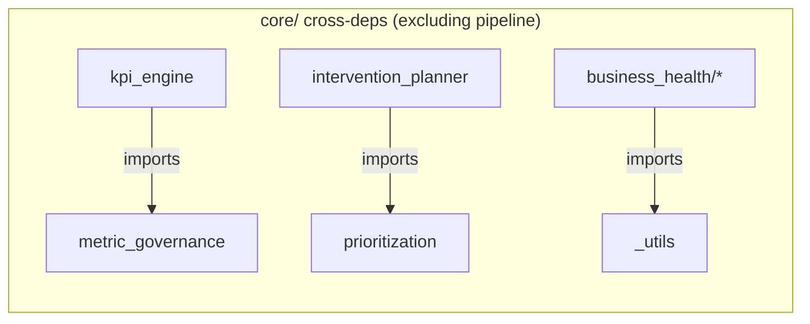
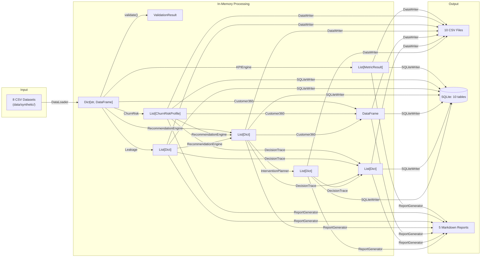

# ProductPulse — Senior Architect Review

**Scope**: Full codebase (`business-product-analytics`)  
**Date**: 2026-05-18  
**Codebase**: 59 source files, 10,692 LOC (source) + 7,734 LOC (tests), 0.72:1 test ratio

---

## 1. System Architecture

```mermaid
graph TB
    subgraph Entrypoints
        CLI["main.py<br/>(CLI: run|status|dashboard)"]
        Streamlit["streamlit_app.py<br/>(989 LOC)"]
    end

    subgraph Orchestration
        Pipeline["ProductAnalyticsPipeline<br/>(721 LOC — ⚠️ god class)"]
    end

    subgraph Phase 1: Data Acquisition
        SynGen["SyntheticDataGenerator<br/>(263 LOC)"]
        Loader["DataLoader<br/>(111 LOC)"]
    end

    subgraph Phase 2: Analytics Engines
        Gov["MetricGovernance<br/>(345 LOC)"]
        KPI["KPIEngine<br/>(607 LOC)"]
        Churn["ChurnRiskEngine<br/>(297 LOC)"]
        Leakage["RevenueLeakageEngine<br/>(234 LOC)"]
        Recs["RecommendationEngine<br/>(273 LOC)"]
    end

    subgraph Phase 3: Decision Layer
        DQ["DataQualityScorer<br/>(236 LOC)"]
        C360["Customer360Engine<br/>(312 LOC)"]
        Seg["SegmentationEngine"]
        Planner["InterventionPlanner<br/>(177 LOC)"]
        Traces["DecisionTraceEngine<br/>(263 LOC)"]
        Lineage["MetricLineageEngine"]
        Health["ProductHealthScoreEngine"]
    end

    subgraph Persistence
        CSVWriter["DataWriter<br/>(186 LOC)"]
        SQLWriter["SQLiteWriter<br/>(112 LOC)"]
        SQLReader["SQLiteReader<br/>(151 LOC)"]
        DB[("SQLite DB")]
    end

    subgraph Business Health Subpackage
        BHS["BusinessHealthScoreEngine<br/>(441 LOC)"]
        Prof["profitability (165)"]
        Rev["revenue_metrics"]
        Cash["cashflow"]
        UE["unit_economics"]
        Growth["growth_metrics"]
        Eff["efficiency_metrics"]
        Risk["risk_metrics"]
    end

    subgraph Orphan Modules ["⚠️ Orphan Modules (no internal consumers)"]
        Anomaly["anomaly_detection.py"]
        ChurnAn["churn_analysis.py"]
        Cohort["cohort_analysis.py"]
        CohortD["cohort_diagnostics.py"]
        Funnel["funnel_analysis.py"]
        RevAn["revenue_analysis.py"]
        RCA["root_cause_analysis.py"]
        Scenario["scenario_simulator.py"]
    end

    CLI --> Pipeline
    Streamlit --> SQLReader --> DB
    Pipeline --> SynGen & Loader
    Pipeline --> Gov --> KPI
    Pipeline --> Churn & Leakage & Recs
    Pipeline --> DQ & C360 & Seg & Planner & Traces & Lineage & Health
    Pipeline --> CSVWriter & SQLWriter --> DB
    Pipeline --> Report["ReportGenerator<br/>(558 LOC)"]

    subgraph Config Files
        CY["config.yaml"]
        MC["metric_catalog.yaml<br/>(29KB)"]
        CR["churn_rules.yaml"]
        RR["recommendation_rules.yaml"]
    end

    Gov -.-> MC
    Churn -.-> CR
    Recs -.-> RR
    Pipeline -.-> CY
```



---

## 2. Dependency Analysis

### 2.1 Afferent Coupling (who depends on me)

| Module | Consumers | Risk |
|---|---|---|
| `utils.paths` | **10 files** | 🔴 Global coupling hub. Import-time side effects. |
| `models.enums` | 5 files | ✅ Stable domain types |
| `models.risk_profile` | 4 files | ✅ Expected |
| `models.schemas` | 3 files | ✅ Expected |
| `models.metrics` | 2 files | ✅ Expected |
| `core.metric_governance` | 2 files | ✅ KPI + pipeline |
| `core.prioritization` | 2 files | ✅ Planner + pipeline |

### 2.2 Efferent Coupling (what I depend on)

| Module | Internal Imports | Risk |
|---|---|---|
| `pipeline.py` | **23 internal imports** | 🔴 Maximum coupling — imports everything |
| `business_health/__init__.py` | 8 | ✅ Subpackage barrel |
| `churn_risk.py` | 5 | ✅ Reasonable |
| `recommendation_engine.py` | 4 | ✅ Reasonable |
| `streamlit_app.py` | 4 (+ 30 from ui_helpers) | 🟡 Heavy UI import |

### 2.3 Intra-Layer Dependencies



**Verdict**: Core engines are well-isolated. Only 3 intra-core dependencies exist outside of pipeline.py. No circular dependencies detected.

---

## 3. Dead Code & Orphan Analysis

### 3.1 Orphan Core Modules (7 files, ~1,060 LOC)

These modules are tested but **never imported by any production code**:

| Module | LOC | Has Tests? | Status |
|---|---|---|---|
| [anomaly_detection.py](file:///Users/andrewshwarts/Documents/Git_main/business-product-analytics/src/core/anomaly_detection.py) | 116 | ✅ | Orphan — not wired into pipeline |
| [churn_analysis.py](file:///Users/andrewshwarts/Documents/Git_main/business-product-analytics/src/core/churn_analysis.py) | 134 | ✅ | Orphan — overlaps with churn_risk.py |
| [cohort_analysis.py](file:///Users/andrewshwarts/Documents/Git_main/business-product-analytics/src/core/cohort_analysis.py) | 170 | ✅ | Orphan — standalone analytics |
| [cohort_diagnostics.py](file:///Users/andrewshwarts/Documents/Git_main/business-product-analytics/src/core/cohort_diagnostics.py) | 120 | ✅ | Orphan |
| [funnel_analysis.py](file:///Users/andrewshwarts/Documents/Git_main/business-product-analytics/src/core/funnel_analysis.py) | 174 | ✅ | Orphan |
| [revenue_analysis.py](file:///Users/andrewshwarts/Documents/Git_main/business-product-analytics/src/core/revenue_analysis.py) | 141 | ✅ | Orphan |
| [root_cause_analysis.py](file:///Users/andrewshwarts/Documents/Git_main/business-product-analytics/src/core/root_cause_analysis.py) | 124 | ✅ | Orphan |
| [scenario_simulator.py](file:///Users/andrewshwarts/Documents/Git_main/business-product-analytics/src/core/scenario_simulator.py) | ~80 | ✅ | Orphan |

> [!IMPORTANT]
> These 7 modules represent ~1,060 lines of tested but unreachable code. Either wire them into the pipeline or move to a `contrib/` directory with explicit "not yet integrated" status.

### 3.2 Orphan Model Files (4 files, ~230 LOC)

| Module | Consumers | Notes |
|---|---|---|
| `models/customer.py` | 0 | Defines `Customer` dataclass — never used, engines work directly with DataFrames |
| `models/recommendation.py` | 0 | Defines `BusinessRecommendation` — engine returns plain dicts instead |
| `models/scenario.py` | 0 | Matches orphan `scenario_simulator.py` |
| `models/subscription.py` | 0 | Same pattern as `customer.py` |
| `models/transaction.py` | 0 | Same pattern |

> [!WARNING]
> The `models/customer.py`, `models/subscription.py`, and `models/transaction.py` dataclasses define domain entities that nothing uses. Engines pass raw `pd.DataFrame` objects with string column names. This is a **design debt marker** — the typed models exist but the codebase chose DataFrames over domain objects.

---

## 4. Module Size Distribution

```
 1,226  app/ui_helpers.py         ████████████████████████ ← Largest. Pure functions, acceptable.
   989  app/streamlit_app.py      ████████████████████
   721  src/core/pipeline.py      ██████████████▍  ← ⚠️ God class
   608  src/core/kpi_engine.py    ████████████▏    17 metric methods, justified size
   558  src/core/report_generator  ███████████▏    Markdown generation, inherently verbose
   466  src/utils/validation.py   █████████▍       Pure functions, clean
   441  src/core/business_health/ ████████▉        Composite scorer, well-structured
   345  src/core/metric_governance ██████▉
   312  src/core/customer_360.py  ██████▎
   297  src/core/churn_risk.py    █████▉
   273  src/core/recommendation   █████▍
```

**Assessment**: Only `pipeline.py` exceeds healthy module size. `ui_helpers.py` is large but contains 30+ pure utility functions — acceptable for a helpers module.

---

## 5. Package Boundary Analysis

### Intended Layering

```
adapters/ ← IO only, no business logic
core/    ← Analytics engines, no IO
models/  ← Data contracts, zero logic
utils/   ← Cross-cutting concerns
app/     ← Presentation layer
```

### Violations Found

| Violation | Severity | Location |
|---|---|---|
| `core/pipeline.py` imports from `adapters/` | 🟡 Medium | Expected for orchestrator, but serialization logic should move to adapters |
| `core/churn_risk.py` imports `utils.paths.CONFIG_DIR` | 🟡 Medium | YAML path coupling. Should accept path via constructor. |
| `core/recommendation_engine.py` imports `utils.paths.CONFIG_DIR` | 🟡 Medium | Same issue |
| `core/metric_governance.py` imports `utils.paths.CONFIG_DIR` | 🟡 Medium | Same issue |
| `core/report_generator.py` imports `utils.paths.REPORTS_DIR` | 🟡 Medium | Report generator needs output path — but should receive it, not import it |

> [!NOTE]
> Pattern: 4 core modules directly import filesystem paths from `utils.paths`. All 4 already accept optional path overrides in their constructors (good), but the defaults reach into `utils.paths` at import-time (bad). **Recommendation**: Pass paths explicitly from pipeline `__init__`, remove default `CONFIG_DIR` imports from core modules.

---

## 6. Data Flow Architecture



**Key observation**: The data flows in a strict DAG (no cycles). Phase ordering is correct — churn risk feeds into revenue_at_risk KPI, which feeds into recommendations.

### Type Safety Gap

| Data | Typed Model | Actually Used |
|---|---|---|
| KPI results | `MetricResult` ✅ | `MetricResult` ✅ |
| Risk profiles | `ChurnRiskProfile` ✅ | `ChurnRiskProfile` ✅ |
| Leakage events | ❌ no model | `List[Dict[str, Any]]` 🟡 |
| Recommendations | `BusinessRecommendation` exists but unused ❌ | `List[Dict[str, Any]]` 🟡 |
| Interventions | ❌ no model | `List[Dict[str, Any]]` 🟡 |
| Decision traces | ❌ no model (internal dataclass, exported as dict) | `List[Dict[str, Any]]` 🟡 |

> [!TIP]
> 4 of 6 core data types flow as untyped dicts. The typed models exist for some (`BusinessRecommendation`) but aren't used. This is the single biggest maintainability risk — a column rename in one engine silently breaks downstream consumers.

---

## 7. Security & Reliability Posture

### Security ✅ Good for Local Tool

| Control | Status |
|---|---|
| No `eval`/`exec` | ✅ Safe operator dispatch everywhere |
| SQL injection prevention | ✅ Table name allowlist + `isidentifier()` for columns |
| Read-only DB mode for UI | ✅ `?mode=ro` URI flag |
| Secrets management | ✅ `.env.example`, no hardcoded secrets |
| Input validation | ✅ Full validation gate before analytics |

### Reliability 🟡 Needs Work

| Concern | Status |
|---|---|
| Exception handling | 🟡 Broad `except Exception` in pipeline — catches everything including `KeyboardInterrupt` |
| Retry logic | ❌ None |
| Checkpointing | ❌ Phase 3 failure loses Phase 2 work |
| Idempotency | ❌ `if_exists: replace` overwrites without versioning |
| Graceful degradation | 🟡 Pipeline halts completely on any validation error |

---

## 8. Ranked Improvement Backlog

### Tier 1: Structural Integrity (do first)

| # | Issue | Effort | Impact | Files |
|---|---|---|---|---|
| 1 | **Extract OutputSerializer** — deduplicate CSV/SQLite write blocks | M | 🔴 Reduces pipeline.py by ~200 lines | pipeline.py, new serializer |
| 2 | **Move dir creation from import-time to explicit call** | S | 🔴 Eliminates side effects | paths.py |
| 3 | **Expose `_catalog` via public method** | XS | 🟡 Encapsulation fix | metric_governance.py, pipeline.py |
| 4 | **Deduplicate KPIEngine calculator map** | S | 🟡 Single source of truth | kpi_engine.py |

### Tier 2: Type Safety & Design Debt

| # | Issue | Effort | Impact | Files |
|---|---|---|---|---|
| 5 | **Add typed result dataclasses** for analytics/decision inter-phase data | M | 🟡 Type safety | New models, pipeline.py |
| 6 | **Use existing model dataclasses** (Recommendation, etc.) instead of raw dicts | M | 🟡 Eliminates 4 orphan models | recommendation_engine, leakage, etc. |
| 7 | **Add DI for engines** in pipeline constructor | M | 🟡 Testability | pipeline.py |
| 8 | **Fix Streamlit double-import** | S | 🟡 Clean imports | streamlit_app.py |

### Tier 3: Housekeeping

| # | Issue | Effort | Impact | Files |
|---|---|---|---|---|
| 9 | **Decide on 7 orphan engine modules** — wire in or move to contrib/ | M | 🟡 ~1,060 LOC clarity | 7 core modules |
| 10 | **Delete requirements.txt** (pyproject.toml is canonical) | XS | 🟢 No drift risk | requirements.txt |
| 11 | **Remove config path imports from core engines** — pass via constructor only | S | 🟢 Cleaner boundaries | 4 core modules |
| 12 | **Add table name validation to SQLiteWriter.read_table** | XS | 🟢 Consistency | sqlite_writer.py |

### Tier 4: Future-Proofing

| # | Issue | Effort | Impact | Files |
|---|---|---|---|---|
| 13 | **Add run-stamping** (run_id, timestamp) to all outputs | S | 🟢 Audit trail | pipeline.py, schemas |
| 14 | **Add intermediate checkpointing** between phases | M | 🟢 Resilience | pipeline.py |
| 15 | **Consider structured logging** (JSON format) | S | 🟢 Observability | utils/logging.py |

---

## 9. Architecture Decision Records (Recommended)

| ADR | Question | Current Answer | Should Document? |
|---|---|---|---|
| ADR-001 | DataFrame vs typed domain objects | DataFrames for data, typed for risk/metrics | Yes — explain the hybrid approach |
| ADR-002 | SQLite vs Postgres | Local-only, zero-infra | Yes — document scale ceiling |
| ADR-003 | Rule-based vs ML engines | Rules for explainability | Yes — document trade-offs |
| ADR-004 | Batch vs streaming | Batch fits current workflow | Yes — note streaming triggers |
| ADR-005 | Orphan modules strategy | Tested but unwired | Yes — decide: phase in or remove |

---

## 10. Verdict

```
Architecture Health: ⭐⭐⭐⭐ (4/5)
```

**Strong foundation**. Well-layered, deterministic, well-tested. Zero circular dependencies, clean data flow DAG.

**Main risks**:
1. Pipeline god class (structural, not functional)
2. 1,290 lines of orphan code (7 engines + 4 models)
3. Untyped dict data flow between phases
4. Import-time side effects

None of these are blocking. All fixable incrementally without rearchitecting.
