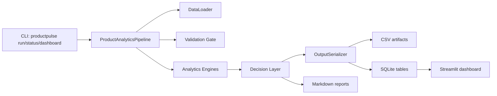

# ProductPulse Architecture

[Back to README](../README.md)

ProductPulse is a single-process, local-first analytics engine. It generates or
loads SaaS operating data, validates it, runs deterministic analytics engines,
and publishes CSV, SQLite, and Markdown outputs for the dashboard and reports.

## System Shape

## Layer Boundaries

| Layer | Path | Responsibility | Rule |
| --- | --- | --- | --- |
| Adapters | `src/adapters/` | CSV, SQLite, synthetic data, artifact serialization | Own IO details |
| Core | `src/core/` | Metric, churn, leakage, recommendation, decision logic | No direct filesystem defaults |
| Models | `src/models/` | Dataclasses, enums, schemas, phase result contracts | No IO |
| Utils | `src/utils/` | Paths, validation, logging helpers | Cross-cutting only |
| App | `app/` | Read-only Streamlit presentation | Reads through `SQLiteReader` |

`ProductAnalyticsPipeline` is the composition root. It owns dependency
construction, config resolution, directory creation, phase ordering, and calls
into adapters/core modules.

## Pipeline Phases

1. Generate synthetic data when enabled.
2. Load configured datasets through `DataLoader`.
3. Run validation gate and halt on blocking errors.
4. Run Phase 2 analytics engines and return `AnalyticsResult`.
5. Run decision layer and return `DecisionLayerResult`.
6. Build output artifacts once through `OutputSerializer`.
7. Write CSV, SQLite, and Markdown reports.

## Data Contracts

Pipeline phase boundaries now use typed dataclasses:

| Contract | File | Purpose |
| --- | --- | --- |
| `AnalyticsResult` | `src/models/pipeline_results.py` | KPIs, churn risk, leakage, recommendations |
| `DecisionLayerResult` | `src/models/pipeline_results.py` | data quality, Customer 360, interventions, traces, lineage, health |
| `PipelineResult` | `src/core/pipeline.py` | final run outcome |

Tabular output schemas remain centralized in `src/models/schemas.py`.
`OutputSerializer` builds artifact DataFrames once, adds deterministic
`run_id`/`generated_at` columns, then reuses the same artifact dictionary for
CSV and SQLite writes.

## Configuration

Runtime config lives in `config/config.yaml`. Supporting governance and rules
live beside it:

- `metric_catalog.yaml`
- `churn_rules.yaml`
- `recommendation_rules.yaml`

For tests or alternate config files, pipeline uses sibling governance/rule files
when present, otherwise falls back to the project `config/` directory.

## Security Posture

- No external network calls in pipeline or dashboard.
- No `eval`/`exec` for YAML formulas or rules.
- SQLite dashboard reader is read-only.
- SQLite table reads validate table identifiers/allowlists before interpolation.
- Secrets and local AI assistant state are ignored in `.gitignore`.

## Architecture Decisions

### ADR-001: DataFrames vs Typed Domain Objects

Decision: keep Pandas DataFrames inside analytics engines and use typed
dataclasses at phase boundaries.

Reason: metric and cohort calculations are naturally tabular. Full row-level
domain object conversion would add overhead without improving current output
quality. Existing domain dataclasses remain extension contracts, not runtime
pipeline dependencies.

### ADR-002: SQLite vs Postgres

Decision: use local SQLite for dashboard persistence.

Reason: portfolio project is local-first, zero-infra, and privacy-safe. If
multi-user access or concurrent writes become requirements, replace SQLite with
a database adapter rather than changing core engines.

### ADR-003: Rules vs ML

Decision: use deterministic rules for churn, recommendations, and leakage.

Reason: explainability is a project goal. Every recommendation can be traced to
inputs, thresholds, and generated decision traces. ML can be added later as an
optional signal, not a replacement for rule provenance.

### ADR-004: Batch vs Streaming

Decision: batch pipeline.

Reason: current workflow is `run -> inspect dashboard -> review reports`.
Streaming would add operational complexity without a real-time product
requirement.

### ADR-005: Advanced Analytics Modules

Decision: keep anomaly, cohort, funnel, scenario, revenue, churn diagnostic, and
root-cause modules as tested advanced analytics modules until a user-facing
workflow is defined.

Reason: these modules are covered by tests and useful for future portfolio
expansion, but forcing them into the main pipeline would create outputs without
clear stakeholders. Integration rule: new pipeline usage must add an output
schema, dashboard/report surface, and tests.

## Current Scale Boundary

The system is designed for local demos and small SaaS-style datasets. It is not
yet designed for millions of rows, concurrent writes, or hosted multi-tenant
usage. Those requirements should trigger database, orchestration, and
observability changes.
