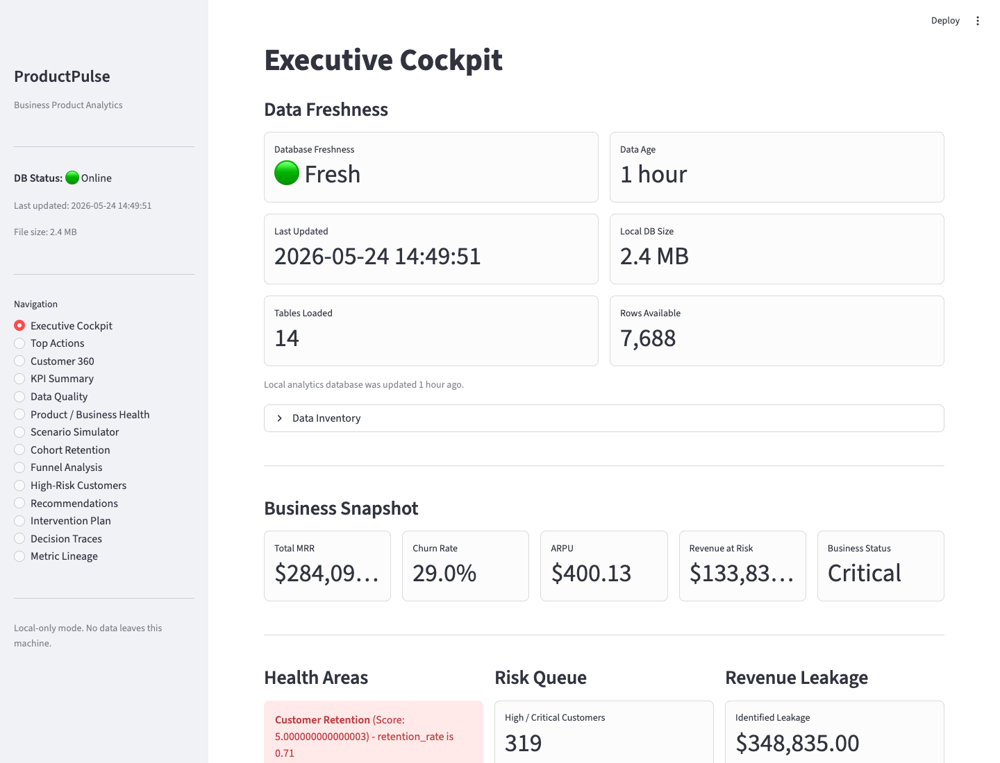
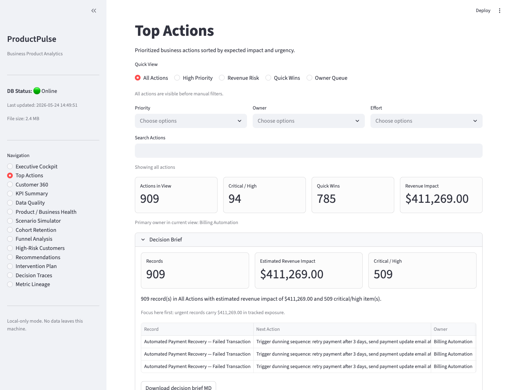
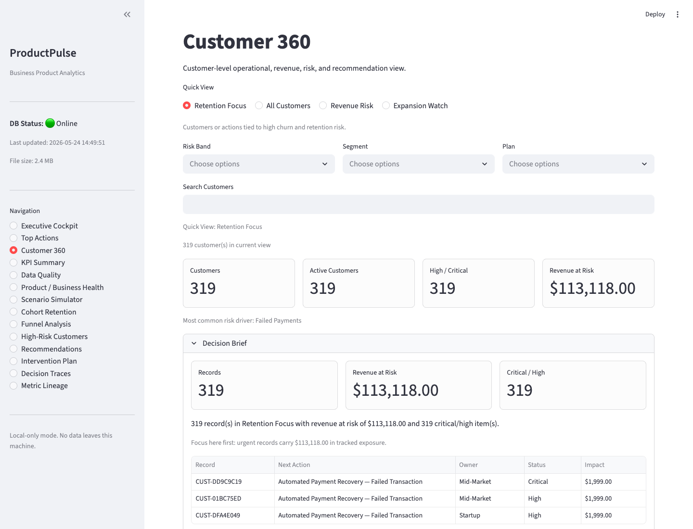
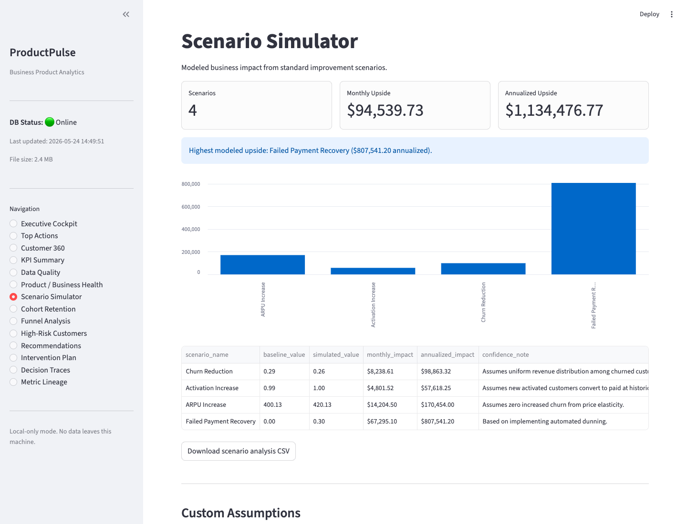

# ProductPulse Portfolio Case Study

[Back to README](../README.md)

ProductPulse is a local-first SaaS analytics decision engine. It turns
synthetic product, billing, support, and customer-success signals into governed
KPIs, churn risk, revenue leakage findings, and prioritized interventions.

This case study is written for portfolio review. It explains what the project
solves, how it is built, what tradeoffs were made, and where to inspect proof.

## 1. Problem

Product and customer-success teams often have operational signals spread across
billing, usage, support, NPS, and subscription data. The hard part is not only
calculating metrics. The hard part is converting those signals into clear,
traceable decisions:

- Which customers need attention first?
- Which risks are tied to revenue?
- Which billing issues are leaking money?
- Which recommendations can be explained without opaque model behavior?
- Which outputs can a reviewer reproduce locally?

ProductPulse solves this as a deterministic decision system instead of a hosted
SaaS or black-box ML product.

## 2. Scope

| Area | Implementation |
| --- | --- |
| Data | Synthetic SaaS operating data |
| Runtime | Single-process local Python pipeline |
| Storage | CSV snapshots plus local SQLite for dashboard reads |
| Dashboard | Local Streamlit app |
| Decision model | Rule-based, explainable scoring and recommendations |
| Quality gate | Compile, Ruff, Pyrefly, pytest, coverage, Docker smoke check |
| Privacy posture | No real customer data, no cloud dependency |

Out of scope: production hosting, live customer ingestion, authentication,
multi-user concurrency, and ML prediction serving.

## 3. Current Snapshot

The committed demo snapshot shows:

| Metric | Value |
| --- | --- |
| Monthly Recurring Revenue | $284,090 |
| ARPU | $400.13 |
| Customer Churn Rate | 29.0% |
| Revenue at Risk | $133,831 |
| High/Critical Risk Customers | 319 |
| Revenue Leakage Events | 953 |
| Estimated Revenue Leakage | $348,835 |
| Planned Interventions | 909 |
| Data Quality Status | 8 datasets Good |
| Test Suite | 708 tests, 100% coverage gate |

Source evidence:

- [Executive summary](../reports/executive_summary.md)
- [Data quality report](../reports/data_quality_report.md)
- [Risk register](../reports/risk_register.md)
- [Intervention plan](../reports/intervention_plan.md)

## 4. User Experience

The dashboard is designed for review and operational triage, not marketing.
It prioritizes dense but readable decision surfaces:

- Executive Cockpit for freshness, business health, risk, leakage, and actions.
- Top Actions for priority queues, owners, quick views, and exports.
- Customer 360 for account-level risk, recommendations, traces, and queueing.
- Scenario Simulator for custom assumptions and upside estimates.
- Decision Traces and Metric Lineage for explainability and governance review.



| Top Actions | Customer 360 |
| --- | --- |
|  |  |



## 5. Architecture

ProductPulse uses a clean, adapter-driven architecture. Core analytics modules
do not own filesystem or dashboard concerns.

```text
CLI -> Pipeline -> DataLoader -> Validation Gate -> Core Engines
    -> Decision Layer -> OutputSerializer -> CSV + SQLite + Reports
    -> Streamlit Dashboard
```

Key boundaries:

| Layer | Responsibility |
| --- | --- |
| `src/adapters/` | CSV, SQLite, synthetic data, artifact serialization |
| `src/core/` | KPI, churn, leakage, recommendations, health, scenario logic |
| `src/models/` | Dataclasses, enums, schemas, phase result contracts |
| `app/` | Read-only Streamlit dashboard using SQLite adapter methods |
| `config/` | Metric catalog, churn rules, recommendation rules, runtime config |

Detailed architecture evidence:

- [Architecture guide](ARCHITECTURE.md)
- [Metric catalog guide](METRIC_CATALOG.md)
- [Generated artifacts policy](GENERATED_ARTIFACTS.md)

## 6. Engineering Decisions

| Decision | Reason |
| --- | --- |
| Local-first execution | Keeps demo reproducible, private, and infrastructure-free |
| Deterministic rules over ML | Makes every recommendation explainable and testable |
| SQLite for dashboard serving | Avoids database setup while preserving read adapter boundary |
| Tracked demo artifacts | Lets reviewers inspect outputs without running the pipeline first |
| 100% coverage gate | Forces edge cases into tests before portfolio polish |
| Docker smoke check in CI | Protects containerized demo path from silent breakage |

One example: revenue leakage detection now sorts unbilled usage records before
writing artifacts. That prevents noisy generated diffs across runs while keeping
the business result unchanged.

## 7. Quality Gates

Local verification:

```bash
make ci
make docker-check
```

CI verification:

- Python 3.12 job runs compile, Ruff, Pyrefly, pytest, and coverage.
- Docker smoke job validates Compose config and builds the demo image.
- CLI entrypoint is checked with `productpulse --help`.

Current status:

- 708 tests passing.
- 100.00% coverage.
- Docker demo image builds successfully.
- GitHub Actions runs both Python and Docker checks on push and PR.

## 8. Review Path

Fast review:

1. Read this case study.
2. Open [README](../README.md) and inspect the dashboard screenshots.
3. Open [Executive summary](../reports/executive_summary.md).
4. Open [Architecture guide](ARCHITECTURE.md).
5. Check CI badge in the README.

Hands-on review:

```bash
make setup
make ci
make run
make status
make dashboard
```

Containerized review:

```bash
make docker-check
make docker-demo
```

## 9. Tradeoffs

| Tradeoff | Impact | Future path |
| --- | --- | --- |
| Synthetic data only | Safe for portfolio, not a real integration | Add adapter examples for warehouse/API inputs |
| Batch pipeline | Simple and reproducible | Add orchestration only if real scheduling is needed |
| In-memory Pandas | Fast for demo scale | Move heavy reads to SQL/Polars for larger datasets |
| Rule-based recommendations | Explainable, deterministic | Add optional ML or LLM summaries behind traceable evidence |
| Local Streamlit | Easy review path | Add hosted deployment only when auth and data policy exist |

## 10. Outcome

ProductPulse now demonstrates a complete local analytics product loop:

- Synthetic input generation.
- Schema validation and governance.
- KPI, churn, leakage, scenario, cohort, and funnel analytics.
- Explainable recommendations and decision traces.
- Dashboard triage and CSV/Markdown exports.
- Full Python and Docker CI gates.
- Portfolio screenshots and reproducible review docs.

The project shows practical analytics engineering, product thinking,
architecture boundaries, testing discipline, and user-facing delivery in one
reviewable repository.
