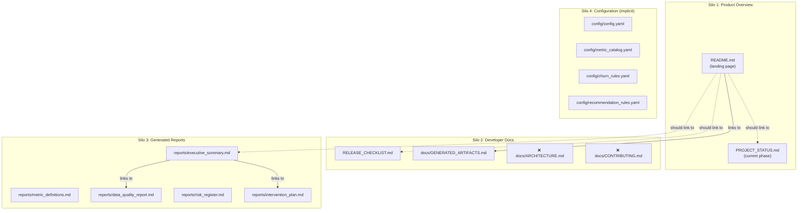

# ProductPulse — SEO Structure Architect Review

**Scope**: README.md, docs/, reports/, PROJECT_STATUS.md, pyproject.toml — GitHub repo discoverability & documentation architecture  
**Date**: 2026-05-18  
**Context**: Local Python tool (no deployed website). SEO targets = GitHub search, Google Code Search, developer portfolio discovery.

---

## 1. Current Content Inventory

| Document | LOC | H1 | H2s | H3s | Role |
|---|---|---|---|---|---|
| [README.md](file:///Users/andrewshwarts/Documents/Git_main/business-product-analytics/README.md) | 216 | 1 ✅ | 14 | 0 ❌ | Primary landing page |
| [PROJECT_STATUS.md](file:///Users/andrewshwarts/Documents/Git_main/business-product-analytics/PROJECT_STATUS.md) | 34 | 1 ✅ | 4 | 0 | Status tracker |
| [RELEASE_CHECKLIST.md](file:///Users/andrewshwarts/Documents/Git_main/business-product-analytics/RELEASE_CHECKLIST.md) | 88 | 1 ✅ | 9 | 0 | Dev process |
| [docs/GENERATED_ARTIFACTS.md](file:///Users/andrewshwarts/Documents/Git_main/business-product-analytics/docs/GENERATED_ARTIFACTS.md) | 31 | 1 ✅ | 2 | 0 | Git policy |
| [reports/executive_summary.md](file:///Users/andrewshwarts/Documents/Git_main/business-product-analytics/reports/executive_summary.md) | 133 | 1 ✅ | 11 | 0 | Auto-generated |
| [reports/metric_definitions.md](file:///Users/andrewshwarts/Documents/Git_main/business-product-analytics/reports/metric_definitions.md) | ~600 | 1 ✅ | 37 | 0 ❌ | Auto-generated |

---

## 2. README.md Header Hierarchy Audit

### Current Structure (flat)

```
H1: ProductPulse - Business Product Analytics Decision Engine ✅
├── H2: Description
├── H2: Architecture
├── H2: Features
├── H2: Tech Stack
├── H2: Project Structure
├── H2: Installation
├── H2: Usage
├── H2: Code Quality
├── H2: Local Streamlit Dashboard
├── H2: Configuration
├── H2: Data Storage
├── H2: Governance Layer
├── H2: Decision Engine Logic
├── H2: Development Notes
├── H2: Skill Mapping
├── H2: Limitations
├── H2: Future Improvements
└── H2: License
```

### Issues Found

| Issue | Severity | Details |
|---|---|---|
| **No H3 hierarchy** | 🔴 | 18 H2s at same level — flat, unscannable |
| **No Table of Contents** | 🟡 | 216 lines without navigation |
| **Redundant sections** | 🟡 | "Installation" + "Usage" + "Code Quality" + "Development Notes" overlap |
| **"Description" as section name** | 🟡 | Generic label — should be implicit under H1 |
| **Dashboard buried at line 125** | 🟡 | Key differentiator hidden mid-doc |
| **Skill Mapping section** | 🟢 | Portfolio-specific, good for discoverability |
| **No badges for coverage/LOC** | 🟢 | Missing signals GitHub users scan for |

### Proposed Structure (nested, scannable)

```
H1: ProductPulse — Business Product Analytics Decision Engine
│
├── [Badges row]
├── [1-paragraph intro — no H2 header needed]
│
├── H2: Key Features
│   ├── H3: Metric Governance Engine
│   ├── H3: Rule-Based Churn Scoring
│   ├── H3: Revenue Leakage Detection
│   ├── H3: Prioritized Recommendations
│   └── H3: Local Streamlit Dashboard
│
├── H2: Architecture
│   ├── H3: Pipeline Design
│   └── H3: Project Structure
│
├── H2: Quick Start
│   ├── H3: Installation
│   ├── H3: Run Pipeline
│   ├── H3: Launch Dashboard
│   └── H3: CLI Reference
│
├── H2: Configuration
│   ├── H3: Business Rules (YAML)
│   └── H3: Reproducibility
│
├── H2: Code Quality & CI
│   ├── H3: Local Commands
│   └── H3: GitHub Actions
│
├── H2: How It Works
│   ├── H3: Governance Layer
│   ├── H3: Decision Engine Logic
│   └── H3: Data Flow
│
├── H2: Skill Mapping
│
├── H2: Limitations & Future Work
│
└── H2: License
```

> [!TIP]
> This restructure reduces 18 H2s → 8 H2s + 14 H3s. Creates clear content clusters for scanning. Dashboard promoted to Features section (line ~30 instead of line 125).

---

## 3. Content Silo Map



### Missing Content Nodes

| Gap | Priority | Why |
|---|---|---|
| `docs/ARCHITECTURE.md` | 🔴 | README mentions architecture but no deep dive. Separate doc should have diagrams, layer descriptions, ADRs |
| `docs/CONTRIBUTING.md` | 🟡 | Standard open-source signal. GitHub looks for this file specifically |
| `docs/METRIC_CATALOG.md` | 🟡 | Human-readable version of metric_catalog.yaml for non-developers |
| `CHANGELOG.md` | 🟡 | GitHub renders this specially. Release history signals project maturity |

---

## 4. Internal Linking Matrix

Current state: **2 internal links** across 7 documents. Very sparse.

| From | To | Link Exists? |
|---|---|---|
| README → PROJECT_STATUS | ❌ | Should link |
| README → RELEASE_CHECKLIST | ❌ | Should link |
| README → docs/GENERATED_ARTIFACTS | ✅ | Line 170 |
| README → reports/executive_summary | ❌ | Should link (showcase) |
| README → reports/metric_definitions | ❌ | Should link |
| PROJECT_STATUS → README | ❌ | Should link back |
| RELEASE_CHECKLIST → README | ❌ | Should link back |
| executive_summary → intervention_plan | ✅ | Line 110 |
| executive_summary → data_quality_report | ✅ | Line 118 |
| metric_definitions → executive_summary | ❌ | Should cross-link |

> [!IMPORTANT]
> **Recommendation**: Add a "Documentation" section to README with links to all docs. Each doc should link back to README. This creates a hub-and-spoke internal linking pattern.

---

## 5. Generated Reports Structure Audit

### reports/metric_definitions.md — 37 flat H2s

```
H1: ProductPulse - Metric Definitions
├── H2: Monthly Recurring Revenue (MRR)
├── H2: Average Revenue Per User (ARPU)
├── H2: Expansion Revenue
├── ... (34 more H2s)
└── H2: Churn Exposure
```

**Problem**: 37 metrics at same hierarchy level. No grouping.

**Recommended restructure** (matches `business_health/` subpackage):

```
H1: ProductPulse - Metric Definitions
├── H2: Revenue Metrics
│   ├── H3: Monthly Recurring Revenue (MRR)
│   ├── H3: Average Revenue Per User (ARPU)
│   ├── H3: Expansion Revenue
│   ├── H3: Contraction Revenue
│   ├── H3: Gross Revenue Retention (GRR)
│   ├── H3: Net Revenue Retention (NRR)
│   └── H3: Revenue at Risk
├── H2: Product Engagement Metrics
│   ├── H3: Activation Rate
│   ├── H3: Usage Frequency
│   ├── H3: Key Action Rate
│   ├── H3: Engagement Drop Rate
│   ├── H3: Feature Adoption Proxy
│   └── H3: Time to Activation
├── H2: Customer Health Metrics
│   ├── H3: Customer Churn Rate
│   ├── H3: Retention Rate
│   ├── H3: Average NPS
│   └── H3: Support Burden
├── H2: Profitability Metrics
│   ├── H3: Gross Profit / Margin
│   ├── H3: Operating Margin
│   ├── H3: Net Margin
│   ├── H3: EBITDA
│   └── H3: Return on Investment (ROI)
├── H2: Unit Economics
│   ├── H3: Customer Lifetime Value (LTV)
│   ├── H3: Customer Acquisition Cost (CAC)
│   └── H3: LTV:CAC Ratio
├── H2: Growth Metrics
│   ├── H3: Customer Growth Rate
│   └── H3: Growth Efficiency
├── H2: Efficiency Metrics
│   ├── H3: Revenue Per Employee
│   └── H3: Sales Efficiency (Magic Number)
└── H2: Risk Metrics
    ├── H3: Customer Concentration Risk
    └── H3: Churn Exposure
```

> [!TIP]
> This grouping directly mirrors the `business_health/` subpackage (revenue_metrics, profitability, unit_economics, growth_metrics, efficiency_metrics, risk_metrics). Aligning report structure with code structure creates conceptual consistency.

---

## 6. GitHub Repository Discoverability

### pyproject.toml Metadata

Current:
```toml
description = "ProductPulse business product analytics decision engine."
```

**Missing fields** for discoverability:

```toml
[project]
keywords = [
    "analytics",
    "business-intelligence",
    "saas-metrics",
    "churn-prediction",
    "kpi-dashboard",
    "data-governance",
    "revenue-analytics",
    "decision-engine",
    "python-analytics",
    "streamlit-dashboard",
]
classifiers = [
    "Development Status :: 4 - Beta",
    "Intended Audience :: Developers",
    "Topic :: Office/Business :: Financial :: Accounting",
    "Topic :: Scientific/Engineering :: Information Analysis",
    "License :: OSI Approved :: MIT License",
    "Programming Language :: Python :: 3.10",
    "Programming Language :: Python :: 3.11",
    "Programming Language :: Python :: 3.12",
]
```

### GitHub Topics (repo settings)

Recommended topics to set on the GitHub repo page:

```
analytics  saas-metrics  business-intelligence  python  
churn-prediction  kpi-dashboard  data-governance  
streamlit  decision-engine  revenue-analytics
```

### GitHub "About" Description

Current: likely matches pyproject.toml.  
Recommended:
> Rule-based SaaS analytics engine: KPIs, churn risk, revenue leakage, and explainable recommendations. Local-first, no ML.

---

## 7. Schema Markup (if GitHub Pages deployed)

Not applicable today (local tool), but if docs are ever published via GitHub Pages or MkDocs:

```json
{
  "@context": "https://schema.org",
  "@type": "SoftwareApplication",
  "name": "ProductPulse",
  "applicationCategory": "BusinessApplication",
  "operatingSystem": "Cross-platform",
  "offers": {
    "@type": "Offer",
    "price": "0",
    "priceCurrency": "USD"
  },
  "description": "Rule-based SaaS analytics decision engine for KPIs, churn risk, revenue leakage, and business recommendations.",
  "softwareVersion": "1.0.0",
  "programmingLanguage": "Python",
  "license": "https://opensource.org/licenses/MIT",
  "codeRepository": "https://github.com/tryapitsynandrey-web/business-product-analytics"
}
```

---

## 8. Action Items (Ranked)

### Tier 1: README Restructure

| # | Action | Effort | Impact |
|---|---|---|---|
| 1 | **Restructure README H2→H3 hierarchy** per blueprint above | M | 🔴 Scannability, GitHub rendering |
| 2 | **Add Table of Contents** (auto-generated `<!-- TOC -->` or manual) | S | 🔴 Navigation for 200+ line doc |
| 3 | **Promote Dashboard to Features section** | S | 🟡 Key differentiator visibility |
| 4 | **Merge redundant sections** (Installation+Usage→Quick Start, Code Quality+Dev Notes→Development) | S | 🟡 Reduce cognitive load |

### Tier 2: Documentation Architecture

| # | Action | Effort | Impact |
|---|---|---|---|
| 5 | **Create `docs/ARCHITECTURE.md`** — extract from arch review, add diagrams | M | 🔴 Portfolio signal, developer onboarding |
| 6 | **Add internal links** — README→all docs, each doc→README | S | 🟡 Hub-and-spoke linking |
| 7 | **Create `CONTRIBUTING.md`** | S | 🟡 Open-source signal |
| 8 | **Create `CHANGELOG.md`** from git tags | S | 🟡 Maturity signal |

### Tier 3: Generated Report Structure

| # | Action | Effort | Impact |
|---|---|---|---|
| 9 | **Group metric_definitions.md** H2s under category H2/H3 hierarchy | M | 🟡 37 flat H2s → 8 H2s + 37 H3s |
| 10 | **Add cross-links between generated reports** | S | 🟢 Content clustering |

### Tier 4: Repo Metadata

| # | Action | Effort | Impact |
|---|---|---|---|
| 11 | **Add `keywords` and `classifiers` to pyproject.toml** | XS | 🟡 PyPI/GitHub discoverability |
| 12 | **Set GitHub repo topics** (10 recommended topics above) | XS | 🟡 GitHub search ranking |
| 13 | **Update GitHub "About" description** | XS | 🟢 First-impression text |

---

## 9. Snippet Optimization Opportunities

README sections that could rank in GitHub search featured results:

| Section | Snippet Format | Target Query |
|---|---|---|
| Features | **Bulleted list** ✅ already | "python saas analytics engine" |
| Quick Start | **Step-by-step code** ✅ already | "business analytics python setup" |
| Architecture | **Definition paragraph** + diagram | "rule-based analytics architecture" |
| Skill Mapping | **Table** ✅ already | "analytics engineering portfolio project" |

---

## Verdict

Documentation structure is **functional but flat**. No blocking issues, but significant scannability and discoverability improvements available:

1. README needs H3 nesting (18 flat H2s → 8+14 hierarchy)
2. metric_definitions.md needs category grouping (37 flat H2s)
3. Internal linking is nearly absent (2 links across 7 docs)
4. pyproject.toml missing `keywords`/`classifiers`
5. Missing standard docs: ARCHITECTURE.md, CONTRIBUTING.md, CHANGELOG.md
